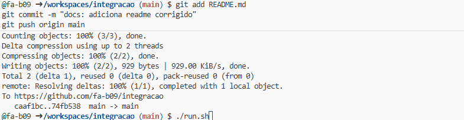

# 🏦 Integração Java & COBOL: Motor de Cálculo Financeiro

Este projeto demonstra uma integração funcional entre uma aplicação moderna em **Java** e um sistema legado em **COBOL**. O Java atua como a interface de utilizador (CLI) e o COBOL processa a lógica matemática de juros com precisão decimal.

## 🚀 Como Executar no GitHub Codespaces

Graças à configuração do `.devcontainer`, o ambiente já vem com o Java e o GnuCOBOL instalados.

1. Clique no botão **Code** > **Open with Codespaces**.
2. No terminal, use o script de automação para compilar e rodar:
   ```bash
   chmod +x run.sh
   ./run.sh



   🏗️ Arquitetura do Sistema
Java (App.java): Responsável pela captura de dados, tratamento de erros (validação de números e vírgulas) e orquestração do processo.

COBOL (calculo.cbl): Atua como o motor de regras de negócio, recebendo valores via argumento e devolvendo o cálculo formatado.

🛠️ Tecnologias Utilizadas
Java 17

GnuCOBOL 3.1+

GitHub Codespaces (Ambiente de desenvolvimento na nuvem)

Shell Script (Automação de compilação)

Projeto desenvolvido para demonstrar competências de integração de sistemas e modernização de legados.